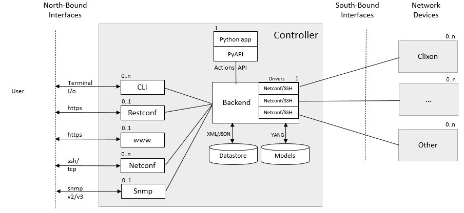

.. _controller_overview:
.. sectnum::
   :start: 13
   :depth: 3
   
********
Overview
********

The clixon network controller is an open-source manager of network devices based on NETCONF and YANG.

The controller is based on `Clixon <https://clixon-docs.readthedocs.io>`_. The controller is a Clixon application.

Goals
-----
The Clixon network controller aims at providing a simple
network controller for NETCONF devices of different vendors, not only Clixon.

Further goals are:

- Programmable network services, with a Python API
- Multiple devices, with different YANG schemas using `RFC 8528: YANG Schema Mount <http://www.rfc-editor.org/rfc/rfc8528.txt>`_ .
- Transactions with validate/commit/revert across groups of devices
- Scaling up to 100 devices.

Architecture
------------

The controller is built on the base of the `CLIgen/Clixon <https://clicon.org>`_ system, where
the controller semantics is implemented using plugins. The `backend`
is the core of the system controlling the datastores and accessing the
YANG models.

APIs
----
The `southbound API` uses only NETCONF over SSH to network
devices. There are no current plans to support other protocols for
device control.

The `northbound APIs` are YANG-derived Restconf, Autocli, Netconf, and
Snmp.  The controller CLI has two modes: operation and configure, with
an autocli configure mode derived from YANG.

A PyAPI module accesses configuration data via the `actions API <controller_actions>`_. The
PyAPI module reads services configuration and writes device data. The
backend then pushes changes to the actual devices using a transaction
mechanism.
