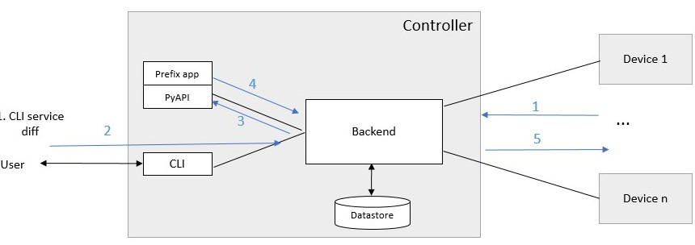

.. _controller_transactions:
.. sectnum::
   :start: 9
   :depth: 3

************
Transactions
************

A basis of controller operation is the use of transactions. Clixon itself has underlying candidate/running datastore transactions. The controller expands the transaction concept to span multiple devices.
There are two such types of composite transactions:

1. `Device connect`: where devices are connected via NETCONF over ssh, key exchange, YANG retrieval and config pull
2. `Config push`: where a service is (optionally) edited, changed device config is pushed to remote devices via NETCONF.
3. `RPC`: where a generic RPC request is sent to devices and wait for replies

Device connect
==============

A `device connect` transaction starts in state `CLOSED` and if succesful stops in `OPEN`. there are multiple intermediate steps as follows (for each device):

1. An SSH session is created to the IP address of the device
2. An SSH login is made which requires:

   a) The device to have enabled a NETCONF ssh sub-system
   b) The public key of the controller to be installed on the device
   c) The public key of the device to be in the `known_hosts` file of the controller
3. A mutual NETCONF `<hello>` exchange
4. Get all YANG schema identifiers from the device using the ietf-netconf-monitoring schema.
5. For each YANG schema identifier, make a `<get-schema>` RPC call (unless already retrieved).
6. Get the full configuration of the device.

Config push
===========
While a `device connect` operates on individual devices, the `config push` transaction operates on all devices. It starts in `OPEN` for all devices and ends in `OPEN` for all devices involved in the transaction:

1. The user edits a service definition and commits
2. The commit triggers PyAPI services code, which rewrites the device config
3. Alternatively, the user edits the device configuration manually
4. The updated device config is validated by the controller
5. The remote device candidate datastore is locked for exclusive access
6. The remote device is checked for updates, if it is out of sync, the transaction is aborted
7. The new config is pushed to the remote devices
8. The new config is validated on the remote devices
9. If validation succeeds on all remote devices, the new config is committed to all devices
10. If validation is not successful, or only a `push validate` was requested, the config is reverted on all remote devices.
11. The remote device candidate datastores are unlocked

After (9) above it is possible to add an extra step (compiler-option):

10. The new config is retrieved from the device and is installed on the controller

Use the show transaction command to get details about transactions::

   cli> show transaction
     <transaction>
        <tid>2</tid>
        <state>DONE</state>
        <result>FAILED</result>
        <description>pull</description>
        <origin>example1</origin>
        <reason>validation failed</reason>
        <timestamp>2023-03-27T18:41:59.031690Z</timestamp>
     </transaction>

Out-of-sync
-----------
In step (5) of the push algorithm described above, the remote device is checked for
updates.

The controller employs a raw method for detecting this as follows:

1. Continuosly store the most recent device config on local storage. This is the "SYNCED" configuration, typically stored at `/usr/local/var/controller`. This is either the most recent pull, or most recent push.
2. Get the complete configuration from the device as part of the transaction. This is the `TRANSIENT` configuration.
3. Compare the SYNCED and TRANSIENT configurations. If they differ, the device configuration has changed and the transaction is aborted.

A failed comparison is an indication that the device configuration has
changed, and that therefore the push is unsafe since it may overwrite
configuration entered by another party, such as a manual configuration of the device.

However, some devices rewrite fields automatically.  Particularly in
the case of a `push`, some devices themselves rewrite fields. Examples
include encrypted or generated fdata, such as certs, keys, passwords
or other data which for some reason are transformed at the time of the
(push) commit.

Therefore, these fields cannot be used as a basis for equivalence and
needs to be ignored in the out-of-sync comparison.

As a side note, an improved method than the raw algorithm described would be preferred,
such as the device itself computing a hash value of its existing
configuration.

Ignoring fields
---------------
The controller has a mechanism for ignoring device YANG fields by
using a local file that augments the device YANG with an "ignore" extension.

For example, assume a "passwd" field should be ignored in a device YANG. First, add or extend a local YANG file::

   module myext {
      ...
      namespace ""urn:example:ext";
      import device-yang {
         prefix dy;
      }
      import clixon-lib {
         prefix cl;
      }
      augment "/dy:configuration/dy:system/dy:passwd" {
         cl:ignore-compare;
      }

where the clixon-lib "ignore-compare" extension augments the passwd field in the original device YANG.

Then add it to a device or device-profile configuration::

   device-profile my-device {
      ...
      module-set {
         module myext {
            namespace ""urn:example:ext";
         }
      }
      ...
   }

When the device YANG is loaded, it will be augmented with the ignore extension, which the controller will use in its comparison algorithm.

Generic RPC
===========
A `generic RPC` transaction starts in state `OPEN`, sends an RPC to each device in the transaction set, waits for replies in state `RPC_GENERIC` and returns the replies to a client and goes back to `OPEN`.

The transaction is initiated by the `device-template-apply` rpc of type `RPC`.

Example
-------
Generic RPC uses the `template` concept

Device state
------------

The following NETCONF message shows an example of sending the `'stats`` RPC to all openconfig devices::

   <rpc xmlns="urn:ietf:params:xml:ns:netconf:base:1.0" message-id="42">
      <device-template-apply xmlns="http://clicon.org/controller">
         <type>RPC</type>
         <devname>openconfig*</devname>
         <template>stats</template>
         <variables>
            <variable>
               <name>MODULES</name>
               <value>true</value>
            </variable>
         </variables>
      </device-template-apply>
   </rpc>]]>]]>

The code above assumes that an RPC template called ``stats`` has been configured, see the :ref:`CLI section <controller_cli>`. As an alternative a template could be inlined.
