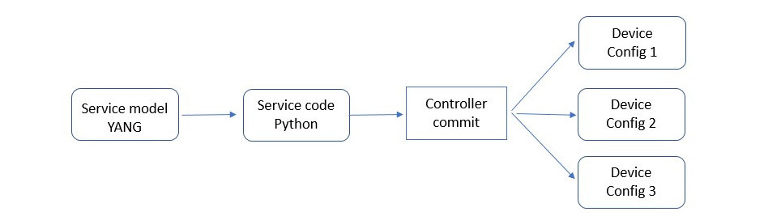

.. _tutorial:
.. sectnum::
   :start: 6
   :depth: 3

****************
Service tutorial
****************

The aim of this tutorial is to create a simple service using the Python API. The setup uses a host controller and two docker openconfig devices.

The tutorial covers the following:

1. The design of a `service model` using YANG
2. Implementation of the `Service code` in Python
3. How to push and commit the resulting configurations to the connected devices

The service is called `ssh-users` and creates users and distributes SSH keys to devices.

The code is written in a `state-less` fashion. This means that each
time the code is executed, it recreates the device configurations in full. The code does not save previous device configurations, there is no saved state in the Python environment.

Prerequisites
=============
Before you start, you need to setup an environment:

1. A `host` running the controller
2. Two `devices` accessible by NETCONF over SSH.

The setup of the environment is described in :ref:`setup tutorial <setup_tutorial>`.

Device config
=============
In any service design, the end result needs to be clearly identified.

In this tutorial, the end result is SSH user configuration in an openconfig device. The following shows such an example:

.. code-block:: xml

   <system xmlns="http://openconfig.net/yang/system">
      <aaa>
	 <authentication>
	    <users>
	       <user>
		  <username>testuser</username>
		  <config>
		     <username>new_username</username>
		     <ssh-key>ssh key AAAAB3NzaC...</ssh-key>
		     <role>admin</role>
		  </config>
	       </user>
	    </users>
	 </authentication>
      </aaa>
   </system>

That is, a user ``new_username`` has a key and an ``operator`` role.

Note that the device configuration depends on the device YANG. A
non-openconfig vendor device would have a different user configuration
since their device YANG is different. The service code is therefore
different. However, the service model can be the same.

Service model
=============
Each service is described using a YANG model.  The controller YANG
is described in the :ref:`YANG section <controller_yang>`.

The service model for this tutorial is called `ssh-users` and is used
to configure SSH users on devices. You should follow this layout if
you define other service models.

A service consists of a list o service instance, each consisting of a
list of users, which in turn has a name, an SSH key and a role.

The YANG service model is as follows:

.. code-block:: yang

   module ssh-users {
       namespace "http://clicon.org/ssh-users";
       prefix ssh-users;
       import clixon-controller { prefix ctrl; }
       revision 2023-05-22 {
	   description "Initial prototype";
       }
       augment "/ctrl:services" {
	   list ssh-users {
	       uses ctrl:created-by-service;
	       key instance;
	       leaf instance {
		   type string;
	       }
	       description "SSH users service";
	       list username {
		   key name;
		   leaf name {
		       type string;
		   }
		   leaf ssh-key {
		       type string;
		   }
		   leaf role {
			type string;
		   }
	       }
	   }
       }
   }

The `ssh-users` module is read by the controller at startup. Place the module in the following file::

  /usr/local/share/controller/main/ssh-users@2023-05-22.yang

All YANGs in the ``main`` directory are loaded at startup.

See the :ref:`Service API <controller_serviceapi>` section for more details on the service YANG.

.. note::
  If you create new service models or modify existing models, you need to restart the ocntroller.

Running the service model
=========================
When the service model is added (or edited), restart the
controller. Restart the controller using systemd::

    $ sudo systemctl restart clixon_controller.service

Start the CLI::

    $ clixon_cli

New CLI commands related to the new service model should now appear in the configure section of the CLI, as follows:

.. code-block:: bash

   $ clixon_cli
   user@test> configure
   user@test[/]# set services ?
   user@test[/]# set services
     <cr>
     properties
     ssh-users             SSH users service
   user@test[/]# set services ssh-users ?
     <instance>
   user@test[/]# set services ssh-users test ?
     <cr>
     created               List of created objects used by services.
     username

To configure a new ssh-user the full sequence of CLI commands are:

.. code-block:: bash

   user@test[/]# set services ssh-users test
   user@test[/]# set services ssh-users test username testuser ssh-key "ssh-rsa AAAAB3NzaC1yc2EAAAADAQABAAABAQDQ6..."
   user@test[/]# set services ssh-users test username testuser role admin

Now the model is configured. The next step is to write Python service code.

Service code
============
The goal of the service code is to write Python code that produces device configurations from the service model.

The configurations can thereafter be pushed and committed to the devices.

Code walk-through
-----------------

Each service has a Python file which contains the Python code for the
service. In the following, the each part of the code is described.

The complete code is given in `Full Python code`_.

Import modules
^^^^^^^^^^^^^^
First, some modules are imported:

.. code-block:: python

   from clixon.element import Element
   from clixon.parser import parse_template
   from clixon.helpers import get_service_instance

The ``Element`` module is used to create new XML elements in the
configuration data tree. The ``parse_template`` module is used to parse
the XML template. The ``get_service_instance`` module is used to get the
service instance.

SERVICE variable
^^^^^^^^^^^^^^^^
Each service module `must` have a variable named ``SERVICE`` which is
the name of the service. The name should correspond to the name of the
YANG model associated with the service.

.. code-block:: python

   SERVICE = "ssh-users"

Setup function
^^^^^^^^^^^^^^
When the code is executed the API server starts with the
function ``setup`` and the following arguments:

* ``root``: the root of the configuration data tree
* ``log`` : a logger object which can be used to log messages
* ``**kwargs`` : a dictionary with additional arguments such as the name of the service instance.

.. code-block:: python

   def setup(root, log, **kwargs):
      # Check if the service is configured
      try:
	 _ = root.services.ssh_users
      except AttributeError:
	 return

The first thing the setup function does is to check whether the
service is configured.  If the service is configured, it is called, if not, the
function simply returns and does nothing.

Service instance
^^^^^^^^^^^^^^^^
The next step is to get the service instance:

.. code-block:: python

      # Get the service instance
      service_instance = get_service_instance(root, SERVICE, **kwargs)

      # Check if the instance is the one we are looking for
      if service_instance is None:
	 return

The helper function ``get_service_instance`` returns a
configuration data tree element with the service instance if it exists, or ``None`` if it does not.

User name
^^^^^^^^^
After that, the username, ssh-key and role from the service instance are retrieved:

.. code-block:: python

   # Get the data from the user
   instance_name = instance.instance.get_data()
   username = user.name.get_data()
   ssh_key = user.ssh_key.get_data()
   role = user.role.get_data()

This is done by iterating over the service instances.

Create template
^^^^^^^^^^^^^^^
The XML template for the new user is created next. The template is a string with placeholders for ``USERNAME``, ``SSH_KEY`` and
``ROLE`` as follows:

.. code-block:: python

   USER_XML = """
   <user cl:creator="ssh-users[instance='{{INSTANCE_NAME}}']" nc:operation="merge" xmlns:cl="http://clicon.org/lib">
      <username>{{USERNAME}}</username>
	 <config>
	    <username>{{USERNAME}}</username>
	    <ssh-key>{{SSH_KEY}}</ssh-key>
	    <role>{{ROLE}}</role>
	 </config>
   </user>
   """

The placeholders are replaced with the values from the service
instance when the template is parsed.

Note that the user configuration is tagged with two attributes:

* ``nc:operation="merge"`` : the NETCONF edit operation
* ``cl:creator="ssh-users[instance='{{INSTANCE_NAME}}']"``

See the :ref:`Service API <controller_serviceapi>` section for more information on the setting of the attributes.

Applying the template
^^^^^^^^^^^^^^^^^^^^^
The template is then instantiated with the values given in the service configuration:

.. code-block:: python

   # Create the XML for the new user
   new_user = parse_template(USER_XML,
			     INSTANCE_NAME=instance_name,
			     USERNAME=username,
			     SSH_KEY=ssh_key,
			     ROLE=role).user

Using the data in the example, this would given the following XML configuration:

.. code-block:: xml

   <user cl:creator="ssh-users[instance='test']" nc:operation="merge" xmlns:cl="http://clicon.org/lib">
      <username>testuser</username>
	 <config>
	    <username>testuser</username>
	    <ssh-key>AAAAB3NzaC...</ssh-key>
	    <role>admin</role>
	 </config>
   </user>

which corresponds to the user configuration given in `Device config`_.

Top-level config
^^^^^^^^^^^^^^^^
Then, the top-level device configuration is created, if it is not already present:

.. code-block:: python

	  # Add the new user to all devices
	  for device in root.devices.device:
	     # Check if the device has the system element
	     if not device.config.get_elements("system"):
		device.config.create("system",
				     attributes={"xmlns": "http://openconfig.net/yang/system"})

	     # Check if the device has the aaa element
	     if not device.config.system.get_elements("aaa"):
		device.config.system.create("aaa")

	     # Check if the device has the authentication element
	     if not device.config.system.aaa.get_elements("authentication"):
		device.config.system.aaa.create("authentication")

	     # Check if the device has the users element
	     if not device.config.system.aaa.authentication.get_elements("users"):
		device.config.system.aaa.authentication.create("users")

This is to ensure that the basic openconfig user configuration is in place on all devices.

Add user
^^^^^^^^
And finally, the new user is added to the configuration data tree:

.. code-block:: python

   # Add the new user to the device
   device.config.system.aaa.authentication.users.add_element(new_user)

Full Python code
----------------
The full Python code for this example service is as follows:

.. code-block:: python

   from clixon.element import Element
   from clixon.parser import parse_template
   from clixon.helpers import get_service_instance

   SERVICE = "ssh-users"

   # The XML template for the new user
   USER_XML = """
   <user cl:creator="ssh-users[instance='{{INSTANCE_NAME}}']" nc:operation="merge" xmlns:cl="http://clicon.org/lib">
       <username>{{USERNAME}}</username>
       <config>
           <username>{{USERNAME}}</username>
	   <ssh-key>{{SSH_KEY}}</ssh-key>
	   <role>{{ROLE}}</role>
       </config>
   </user>
   """

   def setup(root, log, **kwargs):
      # Check if the service is configured
      try:
	 _ = root.services.ssh_users
      except Exception:
	 return

      # Get the service instance
      instance = get_service_instance(root,
				      SERVICE,
				      instance=kwargs["instance"])

      # Check if the instance is the one we are looking for
      if not instance:
	 return

      # Iterate all users in the instance
      for user in instance.username:

	 # Get the data from the user
	 instance_name = instance.instance.get_data()
	 username = user.name.get_data()
	 ssh_key = user.ssh_key.get_data()
	 role = user.role.get_data()

	 # Create the XML for the new user
	 new_user = parse_template(USER_XML,
				   INSTANCE_NAME=instance_name,
				   USERNAME=username,
				   SSH_KEY=ssh_key,
				   ROLE=role).user

	 # Add the new user to all devices
	 for device in root.devices.device:
	    # Check if the device has the system element
	    if not device.config.get_elements("system"):
	        device.config.create("system",
				     attributes={"xmlns": "http://openconfig.net/yang/system"})

	     # Check if the device has the aaa element
	     if not device.config.system.get_elements("aaa"):
		device.config.system.create("aaa")

	    # Check if the device has the authentication element
	    if not device.config.system.aaa.get_elements("authentication"):
	       device.config.system.aaa.create("authentication")

	    # Check if the device has the users element
	    if not device.config.system.aaa.authentication.get_elements("users"):
	       device.config.system.aaa.authentication.create("users")

	    # Add the new user to the device
	    device.config.system.aaa.authentication.users.add(new_user)

The service code is now in place. The next step is to push and commit it to the devices.

Running the Service code
========================

After the service model and code is complete, you can start generating device configurations using the new service in the CLI.

Some of these operations are also covered in the :ref:`CLI tutorial <controller_cli>`.

Restart the PyAPI
-----------------
The python code for the tutorial service is placed in::

   /usr/local/share/controller/modules/ssh_users.py

When the Python file is modified, the API server is restarted using the command::

   $ clixon_cli
   user@test> processes services restart
   <rpc-reply xmlns="urn:ietf:params:xml:ns:netconf:base:1.0">
      <ok xmlns="http://clicon.org/lib"/>
   </rpc-reply>

Alternatively, the controller is restarted.

Commit diff
-----------
The new service can be tested using `commit diff`.  This operation triggers the python code, generates the device configuration and compares it to the existing configuration, but without pushing anything to the devices.

.. code-block:: bash

   $ clixon_cli
   user@test> configure
   user@test[/]# set services ssh-users test
   user@test[/]# set services ssh-users test username testuser ssh-key "ssh-rsa AAAAB3NzaC1yc2EAAAADAQABAAABAQDQ6..."
   user@test[/]# set services ssh-users test username testuser role admin
   user@test[/]# commit diff
   openconfig1:
	       <users xmlns="http://openconfig.net/yang/system">
   +              <user>
   +                 <username>testuser</username>
   +                 <config>
   +                    <username>testuser</username>
   +                    <ssh-key>ssh-rsa AAAAB3NzaC...</ssh-key>
   +                    <role>admin</role>
   +                 </config>
   +              </user>
	       </users>
   OK

The diff is used to inspect the generated device config, and to validate it
locally by the controller. The pyapi has limited validation mechanisms
since it is not aware of the device YANGs.

Commit
------
When the generated code has been inspected and validated, it is pushed and commited to the devices:

.. code-block:: bash

   user@test[/]# commit
   OK

The Python code is executed again and the new user configuration is pushed to the devices. It is also saved on the controller as the new baseline configuration.

In this way, users are added and removed to the devices using service model editing,
inspecting the diff, and then commit.

Remove service
--------------
If the whole service is removed, all users are removed from the device configs:

.. code-block:: bash

   user@test[/]# delete services ssh-users test
   user@test[/]# commit diff
   openconfig1:
	       <users xmlns="http://openconfig.net/yang/system">
   -              <user>
   -                 <username>testuser</username>
   -                 <config>
   -                    <username>testuser</username>
   -                    <ssh-key>AAAAB3NzaC...</ssh-key>
   -                    <role>admin</role>
   -                 </config>
   -              </user>
	       </users>
   OK
   user@test[/]# commit

Summary
=======
This tutorial has shown how to define a simple service by creating a YANG service model and Python service code.

The service was thereafter pushed and committed to a set of virtual openconfig devices.

The service code could be implemented for other (non openconfig) devices, or could be extended with more complex service models and more complex Python code behavior.
